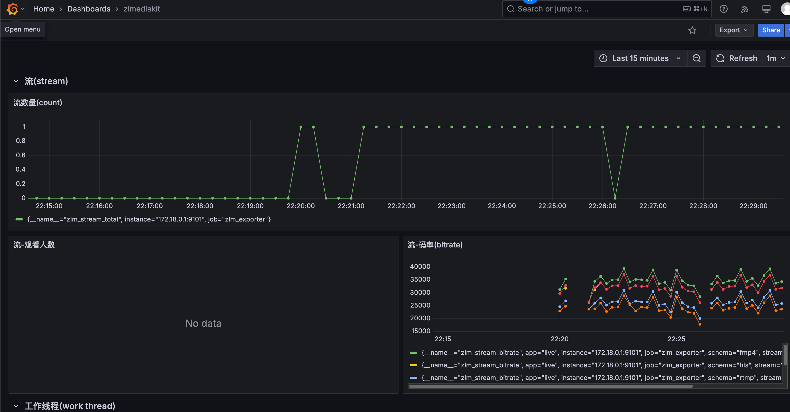
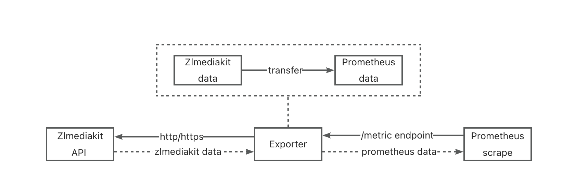

# ZLMediaKit Prometheus Exporter


简体中文 | [English](./README_EN.md)

[ZLMediaKit](https://github.com/ZLMediaKit/ZLMediaKit) 指标的 Prometheus exporter，使用 Go 语言编写。

通过 ZLMediaKit 的 API 收集指标，并暴露为 Prometheus 指标。

[](https://goreportcard.com/report/github.com/standchan/zlm_exporter)
[](https://github.com/standchan/zlm_exporter/blob/master/LICENSE)
[](https://en.cppreference.com/)
[](https://github.com/standchan/zlm_exporter/pulls)

## Grafana DEMO


具体可以访问：
guest/guest

http://1.15.33.150:3000/d/adwaoe6v5tkw0a/zlmediakit


## Workflow


## 使用方法

### Docker

```shell
## 拉取镜像或者构建镜像
docker pull standchan2024/zlm_exporter:latest
# OR
make build-image

## 运行容器
docker run --rm --name zlm_exporter -p 9101:9101 \
  -e ZLM_API_URL=<zlmediakit_api_uri> \
  -e ZLM_API_SECRET=<zlmediakit_api_secret> \
  standchan2024/zlm_exporter:latest

## 获取指标
curl http://localhost:9101/metrics
```

### 源代码
```shell
git clone https://github.com/standchan/ZLMediaKit_exporter
cd ZLMediaKit_exporter
## 构建
make build
## 运行
./zlm_exporter --zlm.api-url=<zlmediakit_api_uri> --zlm.secret=<zlmediakit_api_secret>

## 获取指标
curl http://localhost:9101/metrics
```

## 命令行参数

|  名称                      | 环境变量名称                               | 描述  |
|-------------------------   |-------------------------------------------|----------|
| `zlm.api-url`  |  ZLM_API_URL      |  ZLMediaKit apiServer url, default: http://localhost  |
| `zlm.secret`      | ZLM_API_SECRET            | zlmediakit api secret|
| `web.listen-address`| ZLM_EXPORTER_TELEMETRY_ADDRESS | expose metrics address, default: :9101 |
| `web.telemetry-path`| ZLM_EXPORTER_TELEMETRY_PATH| expose metrics path, default: /metrics |
| `web.ssl-verify` | ZLM_EXPORTER_SSL_VERIFY | skip TLS verify, default: true |

## 收集的指标

| 指标名称                                | 标签                          | 描述                      |
|-------------------------------------------|---------------------------------|----------------------------------|
| `zlm_version_info`                        | branchName、buildTime、commitHash | ZLMediaKit 的版本信息       |
| `zlm_api_status`                          | endpoint                        | API 端点的状态       |
| `zlm_network_threads_total`               | {}                                | 网络线程总数  |
| `zlm_network_threads_load_total`          | {}                                | 网络线程负载总和    |
| `zlm_network_threads_delay_total`         | {}                                | 网络线程延迟总和   |
| `zlm_work_threads_total`                  | {}                                | 工作线程总数     |
| `zlm_work_threads_load_total`             | {}                                | 工作线程负载总和       |
| `zlm_work_threads_delay_total`            | {}                                | 工作线程延迟总和      |
| `zlm_statistics_buffer`                   | {}                                | Statistics buffer                |
| `zlm_statistics_buffer_like_string`       | {}                                | Statistics BufferLikeString      |
| `zlm_statistics_buffer_list`              | {}                                | Statistics BufferList            |
| `zlm_statistics_buffer_raw`               | {}                                | Statistics BufferRaw             |
| `zlm_statistics_frame`                    | {}                                | Statistics Frame                 |
| `zlm_statistics_frame_imp`                | {}                                | Statistics FrameImp              |
| `zlm_statistics_media_source`             | {}                                | Statistics MediaSource           |
| `zlm_statistics_multi_media_source_muxer` | {}                                | Statistics MultiMediaSourceMuxer |
| `zlm_statistics_rtp_packet`               | {}                                | Statistics RtpPacket             |
| `zlm_statistics_socket`                   | {}                                | Statistics Socket                |
| `zlm_statistics_tcp_client`               | {}                                | Statistics TcpClient             |
| `zlm_statistics_tcp_server`               | {}                                | Statistics TcpServer             |
| `zlm_statistics_tcp_session`              | {}                                | Statistics TcpSession            |
| `zlm_statistics_udp_server`               | {}                                | Statistics UdpServer             |
| `zlm_statistics_udp_session`              | {}                                | Statistics UdpSession            |
| `zlm_session_info`                        | id、identifier、local_ip、local_port、peer_ip、peer_port、typeid | 会话信息                     |
| `zlm_session_total`                       | {}                                | 会话总数         |
| `zlm_stream_info`                         | vhost、app、stream、schema、origin_type、origin_url | 流基本信息         |
| `zlm_stream_status`                       | vhost、app、stream、schema         | 流状态 (1: 活跃且有数据流动, 0: 不活跃) |
| `zlm_stream_reader_count`                | vhost、app、stream、schema         | 流读取器计数              |
| `zlm_stream_total_reader_count`          | vhost、app、stream         | 所有 schema 中的总读取器计数 |
| `zlm_stream_bitrate`                     | vhost、app、stream、schema         | 流比特率                  |
| `zlm_stream_total`                       | {}                                | 流总数         |
| `zlm_rtp_server_info`                    | port、stream_id         | RTP 服务器信息                  |
| `zlm_rtp_server_total`                   | {}                                | RTP 服务器总数         |

<details>
<summary>指标详情示例</summary>
# HELP zlm_api_status The status of API endpoint
# TYPE zlm_api_status gauge
zlm_api_status{endpoint="/index/"} 1
zlm_api_status{endpoint="/index/api/addFFmpegSource"} 1
zlm_api_status{endpoint="/index/api/addStreamProxy"} 1
zlm_api_status{endpoint="/index/api/addStreamPusherProxy"} 1
zlm_api_status{endpoint="/index/api/broadcastMessage"} 1
zlm_api_status{endpoint="/index/api/closeRtpServer"} 1
zlm_api_status{endpoint="/index/api/close_stream"} 1
zlm_api_status{endpoint="/index/api/close_streams"} 1
zlm_api_status{endpoint="/index/api/connectRtpServer"} 1
zlm_api_status{endpoint="/index/api/delFFmpegSource"} 1
zlm_api_status{endpoint="/index/api/delStreamProxy"} 1
zlm_api_status{endpoint="/index/api/delStreamPusherProxy"} 1
zlm_api_status{endpoint="/index/api/deleteRecordDirectory"} 1
zlm_api_status{endpoint="/index/api/downloadBin"} 1
zlm_api_status{endpoint="/index/api/downloadFile"} 1
zlm_api_status{endpoint="/index/api/getAllSession"} 1
zlm_api_status{endpoint="/index/api/getApiList"} 1
zlm_api_status{endpoint="/index/api/getMP4RecordFile"} 1
zlm_api_status{endpoint="/index/api/getMediaInfo"} 1
zlm_api_status{endpoint="/index/api/getMediaList"} 1
zlm_api_status{endpoint="/index/api/getMediaPlayerList"} 1
zlm_api_status{endpoint="/index/api/getProxyInfo"} 1
zlm_api_status{endpoint="/index/api/getProxyPusherInfo"} 1
zlm_api_status{endpoint="/index/api/getRtpInfo"} 1
zlm_api_status{endpoint="/index/api/getServerConfig"} 1
zlm_api_status{endpoint="/index/api/getSnap"} 1
zlm_api_status{endpoint="/index/api/getStatistic"} 1
zlm_api_status{endpoint="/index/api/getThreadsLoad"} 1
zlm_api_status{endpoint="/index/api/getWorkThreadsLoad"} 1
zlm_api_status{endpoint="/index/api/isMediaOnline"} 1
zlm_api_status{endpoint="/index/api/isRecording"} 1
zlm_api_status{endpoint="/index/api/kick_session"} 1
zlm_api_status{endpoint="/index/api/kick_sessions"} 1
zlm_api_status{endpoint="/index/api/listRtpSender"} 1
zlm_api_status{endpoint="/index/api/listRtpServer"} 1
zlm_api_status{endpoint="/index/api/loadMP4File"} 1
zlm_api_status{endpoint="/index/api/openRtpServer"} 1
zlm_api_status{endpoint="/index/api/openRtpServerMultiplex"} 1
zlm_api_status{endpoint="/index/api/pauseRtpCheck"} 1
zlm_api_status{endpoint="/index/api/restartServer"} 1
zlm_api_status{endpoint="/index/api/resumeRtpCheck"} 1
zlm_api_status{endpoint="/index/api/seekRecordStamp"} 1
zlm_api_status{endpoint="/index/api/setRecordSpeed"} 1
zlm_api_status{endpoint="/index/api/setServerConfig"} 1
zlm_api_status{endpoint="/index/api/startRecord"} 1
zlm_api_status{endpoint="/index/api/startSendRtp"} 1
zlm_api_status{endpoint="/index/api/startSendRtpPassive"} 1
zlm_api_status{endpoint="/index/api/stopRecord"} 1
zlm_api_status{endpoint="/index/api/stopSendRtp"} 1
zlm_api_status{endpoint="/index/api/updateRtpServerSSRC"} 1
zlm_api_status{endpoint="/index/api/version"} 1
# HELP zlm_exporter_scrapes_total Current total ZLMediaKit scrapes.
# TYPE zlm_exporter_scrapes_total counter
zlm_exporter_scrapes_total 2
# HELP zlm_network_threads_delay_total Total of network threads delay
# TYPE zlm_network_threads_delay_total gauge
zlm_network_threads_delay_total 0
# HELP zlm_network_threads_load_total Total of network threads load
# TYPE zlm_network_threads_load_total gauge
zlm_network_threads_load_total 0
# HELP zlm_network_threads_total Total number of network threads
# TYPE zlm_network_threads_total gauge
zlm_network_threads_total 8
# HELP zlm_rtp_server_total Total number of RTP servers
# TYPE zlm_rtp_server_total gauge
zlm_rtp_server_total 0
# HELP zlm_session_info Session info
# TYPE zlm_session_info gauge
zlm_session_info{id="14396-76",identifier="14396-76",local_ip="127.0.0.1",local_port="554",peer_ip="127.0.0.1",peer_port="64889",typeid="mediakit::RtspSession"} 1
zlm_session_info{id="14399-78",identifier="14399-78",local_ip="127.0.0.1",local_port="80",peer_ip="127.0.0.1",peer_port="64996",typeid="mediakit::HttpSession"} 1
zlm_session_info{id="14400-80",identifier="14400-80",local_ip="127.0.0.1",local_port="80",peer_ip="127.0.0.1",peer_port="64999",typeid="mediakit::HttpSession"} 1
zlm_session_info{id="14406-79",identifier="14406-79",local_ip="127.0.0.1",local_port="80",peer_ip="127.0.0.1",peer_port="65010",typeid="mediakit::HttpSession"} 1
zlm_session_info{id="14407-81",identifier="14407-81",local_ip="127.0.0.1",local_port="80",peer_ip="127.0.0.1",peer_port="65011",typeid="mediakit::HttpSession"} 1
zlm_session_info{id="14408-82",identifier="14408-82",local_ip="127.0.0.1",local_port="80",peer_ip="127.0.0.1",peer_port="65012",typeid="mediakit::HttpSession"} 1
zlm_session_info{id="14409-83",identifier="14409-83",local_ip="127.0.0.1",local_port="80",peer_ip="127.0.0.1",peer_port="65013",typeid="mediakit::HttpSession"} 1
zlm_session_info{id="14410-84",identifier="14410-84",local_ip="127.0.0.1",local_port="80",peer_ip="127.0.0.1",peer_port="65014",typeid="mediakit::HttpSession"} 1
zlm_session_info{id="14411-85",identifier="14411-85",local_ip="127.0.0.1",local_port="80",peer_ip="127.0.0.1",peer_port="65015",typeid="mediakit::HttpSession"} 1
# HELP zlm_session_total Total number of sessions
# TYPE zlm_session_total gauge
zlm_session_total 9
# HELP zlm_statistics_buffer Statistics buffer
# TYPE zlm_statistics_buffer gauge
zlm_statistics_buffer 2286
# HELP zlm_statistics_buffer_like_string Statistics BufferLikeString
# TYPE zlm_statistics_buffer_like_string gauge
zlm_statistics_buffer_like_string 535
# HELP zlm_statistics_buffer_list Statistics BufferList
# TYPE zlm_statistics_buffer_list gauge
zlm_statistics_buffer_list 0
# HELP zlm_statistics_buffer_raw Statistics BufferRaw
# TYPE zlm_statistics_buffer_raw gauge
zlm_statistics_buffer_raw 444
# HELP zlm_statistics_frame Statistics Frame
# TYPE zlm_statistics_frame gauge
zlm_statistics_frame 528
# HELP zlm_statistics_frame_imp Statistics FrameImp
# TYPE zlm_statistics_frame_imp gauge
zlm_statistics_frame_imp 264
# HELP zlm_statistics_media_source Statistics MediaSource
# TYPE zlm_statistics_media_source gauge
zlm_statistics_media_source 7
# HELP zlm_statistics_multi_media_source_muxer Statistics MultiMediaSourceMuxer
# TYPE zlm_statistics_multi_media_source_muxer gauge
zlm_statistics_multi_media_source_muxer 1
# HELP zlm_statistics_rtmp_packet Statistics RtmpPacket
# TYPE zlm_statistics_rtmp_packet gauge
zlm_statistics_rtmp_packet 261
# HELP zlm_statistics_rtp_packet Statistics RtpPacket
# TYPE zlm_statistics_rtp_packet gauge
zlm_statistics_rtp_packet 175
# HELP zlm_statistics_socket Statistics Socket
# TYPE zlm_statistics_socket gauge
zlm_statistics_socket 66
# HELP zlm_statistics_tcp_client Statistics TcpClient
# TYPE zlm_statistics_tcp_client gauge
zlm_statistics_tcp_client 1
# HELP zlm_statistics_tcp_server Statistics TcpServer
# TYPE zlm_statistics_tcp_server gauge
zlm_statistics_tcp_server 43
# HELP zlm_statistics_tcp_session Statistics TcpSession
# TYPE zlm_statistics_tcp_session gauge
zlm_statistics_tcp_session 9
# HELP zlm_statistics_udp_server Statistics UdpServer
# TYPE zlm_statistics_udp_server gauge
zlm_statistics_udp_server 16
# HELP zlm_statistics_udp_session Statistics UdpSession
# TYPE zlm_statistics_udp_session gauge
zlm_statistics_udp_session 0
# HELP zlm_stream_bitrate Stream bitrate
# TYPE zlm_stream_bitrate gauge
zlm_stream_bitrate{app="live",schema="fmp4",stream="test",vhost="__defaultVhost__"} 44878
zlm_stream_bitrate{app="live",schema="hls",stream="test",vhost="__defaultVhost__"} 40432
zlm_stream_bitrate{app="live",schema="rtmp",stream="test",vhost="__defaultVhost__"} 28119
zlm_stream_bitrate{app="live",schema="rtsp",stream="test",vhost="__defaultVhost__"} 28385
zlm_stream_bitrate{app="live",schema="ts",stream="test",vhost="__defaultVhost__"} 40432
# HELP zlm_stream_info Stream basic information
# TYPE zlm_stream_info gauge
zlm_stream_info{app="live",origin_type="rtsp_push",origin_url="rtsp://127.0.0.1:554/live/test",schema="fmp4",stream="test",vhost="__defaultVhost__"} 1
zlm_stream_info{app="live",origin_type="rtsp_push",origin_url="rtsp://127.0.0.1:554/live/test",schema="hls",stream="test",vhost="__defaultVhost__"} 1
zlm_stream_info{app="live",origin_type="rtsp_push",origin_url="rtsp://127.0.0.1:554/live/test",schema="rtmp",stream="test",vhost="__defaultVhost__"} 1
zlm_stream_info{app="live",origin_type="rtsp_push",origin_url="rtsp://127.0.0.1:554/live/test",schema="rtsp",stream="test",vhost="__defaultVhost__"} 1
zlm_stream_info{app="live",origin_type="rtsp_push",origin_url="rtsp://127.0.0.1:554/live/test",schema="ts",stream="test",vhost="__defaultVhost__"} 1
# HELP zlm_stream_reader_count Stream reader count
# TYPE zlm_stream_reader_count gauge
zlm_stream_reader_count{app="live",schema="fmp4",stream="test",vhost="__defaultVhost__"} 0
zlm_stream_reader_count{app="live",schema="hls",stream="test",vhost="__defaultVhost__"} 0
zlm_stream_reader_count{app="live",schema="rtmp",stream="test",vhost="__defaultVhost__"} 0
zlm_stream_reader_count{app="live",schema="rtsp",stream="test",vhost="__defaultVhost__"} 0
zlm_stream_reader_count{app="live",schema="ts",stream="test",vhost="__defaultVhost__"} 0
# HELP zlm_stream_status Stream status (1: active with data flowing, 0: inactive)
# TYPE zlm_stream_status gauge
zlm_stream_status{app="live",schema="fmp4",stream="test",vhost="__defaultVhost__"} 1
zlm_stream_status{app="live",schema="hls",stream="test",vhost="__defaultVhost__"} 1
zlm_stream_status{app="live",schema="rtmp",stream="test",vhost="__defaultVhost__"} 1
zlm_stream_status{app="live",schema="rtsp",stream="test",vhost="__defaultVhost__"} 1
zlm_stream_status{app="live",schema="ts",stream="test",vhost="__defaultVhost__"} 1
# HELP zlm_stream_total Total number of streams
# TYPE zlm_stream_total gauge
zlm_stream_total 1
# HELP zlm_stream_total_reader_count Total reader count across all schemas
# TYPE zlm_stream_total_reader_count gauge
zlm_stream_total_reader_count{app="test",stream="__defaultVhost__",vhost="live"} 0
# HELP zlm_up Was the last scrape of ZLMediaKit successful.
# TYPE zlm_up gauge
zlm_up 1
# HELP zlm_version_info ZLMediaKit version info.
# TYPE zlm_version_info gauge
zlm_version_info{branchName="master",buildTime="2024-06-11T21:28:30",commitHash="c446f6b"} 1
# HELP zlm_work_threads_delay_total Total of work threads delay
# TYPE zlm_work_threads_delay_total gauge
zlm_work_threads_delay_total 104
# HELP zlm_work_threads_load_total Total of work threads load
# TYPE zlm_work_threads_load_total gauge
zlm_work_threads_load_total 0
# HELP zlm_work_threads_total Total number of work threads
# TYPE zlm_work_threads_total gauge
zlm_work_threads_total 8
</details>

## Roadmap

- [x] 添加 Git Action CI/CD，并触发 Docker 构建和推送到 Docker Hub
- [x] GA
- [x] 添加 Grafana 仪表板 / Prometheus 告警使用示例
- [ ] 禁止采集指定指标 feature/disable-metrics
- [ ] 添加更多测试

## 贡献和报告问题

欢迎～


## 致谢
[ZLMediaKit](https://github.com/ZLMediaKit/ZLMediaKit)

[JetBrains](https://www.jetbrains.com/)

[redis_exporter](https://github.com/oliver006/redis_exporter)

[haproxy_exporter](https://github.com/prometheus/haproxy_exporter)

[Prometheus](https://prometheus.io/)

[Cursor](https://www.cursor.com/)

JetBrains/Cursor 为编码提供了出色的工具。

大多数单元测试由 Cursor 自动生成。
